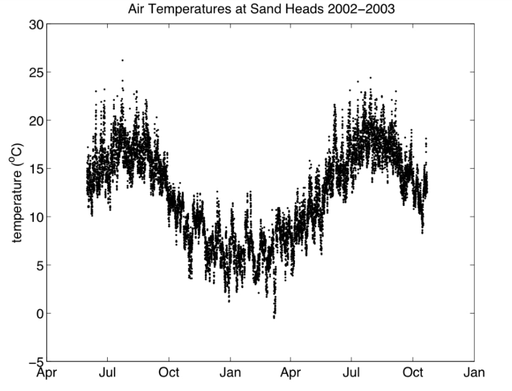
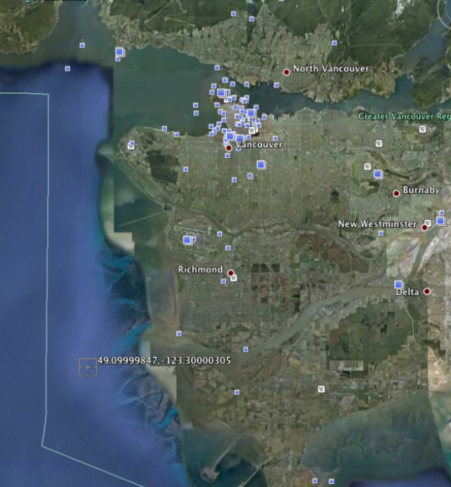

# Lab Week 2

## Overview

The purpose of the first lab is to get you comfortable with the way MATLAB works and to show you (by example) how to do a number of useful things.

Nothing will be graded this week, but you must submit the item(s) noted in Section 10. Future labs will assume you
are familiar with the material here. If you have computer experience some of this may seem trivial but this will not
necessarily be the case later on.

## Pair Programming

During labs you will be working in pairs using a technique called PAIR PROGRAMMING. It works like this:

1. You pair up with someone else
2. One person (the “driver”) sits in front of the computer and types. The other (the “navigator”) watches what is
going on and makes comments.
3. Every 15 minutes, you SWITCH roles (we will announce the switchover time).
4. You are EACH responsible for handing in your own lab (you may or may not have identical labs). You MUST
add a comment to the code with the name of your partner.
5. If you have not completed the lab at the end of the lab period (which is usually the case), you are free to a)
schedule more pair-progamming time with your partner, or b) complete the lab by yourself.

## Goals

* Familiarize yourself with the MATLAB interface and using it on a PC (or your own laptop)
  
  1. logging on!
  2. learn how to make a folder (directory) and work IN THAT folder (directory) in MATLAB

* Learn (by example) how to do a number of useful things within MATLAB, specifically how to:

  1. load and save data
  2. initialize and use variables
  3. make x-y plots of data: playing with colour, symbols, parts of your data set
  4. edit, save and run a basic MATLAB script
  5. comment your code

By the end of the lab you should be comfortable with the following MATLAB operations:

* load, save, ```=```, inputting / saving data and variables
* plot: making simple plots
* ```whos```, ```clear```, ```clf```, ```close```: listing & clearing variables in the workspace, clearing and closing figures
* help: MATLAB help!





## Starting MATLAB

**See also your textbook pg 3-6**

**Organizing your Work:**
If you are using a lab computer, then when you log on you will be provided with a virtual drive for your own data.
This is the Z: drive. In the Z: drive create a folder (also known as a directory) eosc211 and then within that folder,
another sub-folder (sub-directory) lab_week02. The lab_week02 folder will be used to store files useful for
this week’s lab only (make other directories for future labs). Change the CURRENT FOLDER above the command
window to Z:\eosc211\lab_week02, as this will mean MATLAB will automatically read from and write to
that folder. You can do this via the pulldown menu, or by typing the following in the command window:

```matlab
>> cd Z:\eosc211\lab_week02
```

(Do not type the “```>>```” as this merely indicates what the line will look like. Also note that MATLAB itself is case-sensitive, i.e., it matters whether you use upper or lower case.). IMPORTANT: Make sure you are NOT saving your
work to the C: drive. This drive is specific only to the machine that you are working on right now, e.g., PC #27,
which is NOT backed up.
If you are running MATLAB on your own laptop, set up a eosc211 sub-folder in some convenient folder and make
a lab_week02 sub-folder in eosc211. Change the current folder above the command window to this folder.

```{admonition} TIP:
In general there are at least two ways to do most things - via the GUI interface (pull-down menus and so
on), or via typing at the COMMAND LINE∗
. e.g., you can see what files are in your current folder either by (a)
looking at the file list in the “Current Folder” window (GUI approach), or (b) typing ls in the “Command Window”
(COMMAND LINE approach). You may use whichever method you want, but using the command line interface is
better in the long run as you will eventually use these same commands as lines of code in your SCRIPTS.
```

```{admonition} TIP:
Use the up/down-arrow keys to retrieve previous lines, and then edit them by using the left/right arrows if errors
occur due to problems with syntax or semantics.
```

## Some Basics: Creating, Assigning and Listing Variables

**See also your textbook: pg 6-11**

Here we shall see how to create a variable name and assign a value to it. In the command window type:

```matlab
>> radius = 6371;
```

Of course this is the radius of the Earth in km. See class notes from Tuesday for an explanation of what has
happened by doing this.

Use the up arrow and the delete button to repeat the command without the semi-colon at the end. What happens?
Now type:

```matlab
>> pi
```

What happens? It turns out that pi has a special meaning in MATLAB. It is a BUILT-IN FUNCTION that returns
the value of π. This is handy because you will never need to define π when you write MATLAB code.
Now type:

```matlab
>> 2*radius
```

What happens?
In both of the previous examples the result of a particular operation (calling the function pi or performing the
calculation 2*radius ) is assigned to a default BUILT-IN variable ```ans```. We will normally want to be more
sophisticated than this because we will want to later use the result of a particular operation – i.e. we will want the
result to be assigned to a new variable. We do this as follows. Type:

```matlab
>> diameter = 2*radius;
```

and then look at the value assigned to diameter (how do you do this?). Now check your workspace window and in
the Command Window type:

```matlab
>> whos
```

The command ```whos``` lists the variables in the workspace

What does the command ```who``` do?

Variables can be of various types: real numbers, integers, and characters. We shall learn more about these data types in class **next week**.

## Creating, Editing, and Saving a Matlab Script

**See also your textbook: pg 75-80

Her we shall see how to save your MATLAB commands in a script. This is an essential part of programming, because it ensures reproducibility. If you were to quit MATLAB now (by typing ```quit``` in the command window or choosing **MATLAB $\rightarrow$ Quit Matlab**) neither your command history nor your variables ```radius``` or ```diameter``` will be saved.

Do the following to create a MATLAB script:

1. Choose **New $\rightarrow$ Script** from the menu bar (notice the keyboard shortcut for future use) or the specific **New Script** button if you have one (depends on your MATLAB version)
   
2. An editor window will appear. In this, type the following lines:

```matlab
% Script to calculate the surface area of the Earth in square kilometers
radius = 6371;
area = pi*radius*radius
```

What does the ```%``` sign do?

3. Now save your script to a file by choosing **Save $\rightarrow$ Save As** from the menu bar. Notice the choice of directories to which you can save your file. Save it in the ```lab_week02``` folder and name your file ```earthrad.m```. Note that it’s good programming practice not to use spaces or special characters in your filenames.
 
4. In the previous section and in this script we saw how to do a basic mathematical operation (multiplication *).
Experiment with addition, subtraction, and division by creating new variables called rad2, rad3, rad4 that have
values 5 km bigger than the Earth’s radius, 20.3 km smaller and 25% of Earth’s radius respectively. Add the lines of code that do this to your script, add a comment line that explains what they do, and save your script. We will learn more about Computer Math in Week 4.

## Clearing the Workspace, Using Help, and Executing a MATLAB Script

You can CLEAR the MATLAB workspace by typing

```matlab
>> clear
```

Do this and check the workspace. All the variables should have disappeared. The easiest way of finding what ```clear``` does is to type ```help clear```.

```{note}
There is also a ```clear workspace``` button in the GUI. Be careful about using this by accident!
```

You can execute a MATLAB script by typing the name of the script in the command window. (NOTE: to be recognized as a MATLAB script you must save the file with the subscript .m) Try this:

```matlab
>> earthrad
```

You should see your variables radius, area, rad2, rad3, rad4 and area in the Workspace. Any lines in your script
without a semicolon will result in the value of the variable being printed to the Command Window. Play around
with this by deleting and adding semicolons and re-executing your script.
You can also execute a MATLAB script in other ways - e.g. using the RUN button in the pull-down menu for the
EDITOR window. Try this.

## Loading, Plotting, and Saving Data: Air Temperature Example

**See also your textbook: pg 89-101**

In the download section of the course web pages is a link to a file ```lab1.mat```. Copy this to your ```Z:\eosc211\lab_week02``` sub-folder.

A ```.mat``` file can contain one or more named variables. Load them using:

```matlab
>> load lab1
```

You can see the size of these variables by clicking on the WORKSPACE tab, or, as before by typing ```whos```

Note that you will see the variables previously defined, as well as some new ones. If you CLEAR the workspace you can re-load ```lab1.mat```.


This dataset comprises hourly air temperature measurements at Sand Heads, a weather station at the mouth of the Fraser River. There are 12213 measurements (508 days worth).

To see what is in these variables the obvious thing to do is plot them. Try typing:

```matlab
>> plot(temperature)
```

How does your figure compare with the one above? y-axis values? x-axis values? labels? It turns out that because
you have not specified the x-axis, then the x-axis is just the measurement number - i.e., an x-value of 100 means the
100’th measurement value. As the temperature variable is an array of length 12213, the x-axis in the plot goes from
1 to 12213. (We will cover arrays and data structures in class in Week 3.)

We can see a particular element of the array, e.g. the 600'th point (or element) by typing:

```matlab
>> temperature(600)
```

and several points, e.g. the 600th point to the 609th point by typing

```matlab
>> temperature(600:609)
```

So, you can see that we could plot a subset of our data by typing

```matlab
>> figure(2)
>> plot(temperature(2000:4000))
```

Try it. This plots the part of the data set that goes from point (element) 2000 to point (element) 4000 in a new figure window (Figure 2). Note that unless you tell it to do otherwise (we shall see how later in the course), MATLAB will choose the upper and lower limits of the y-axis automatically, so the scale on this plot might look quite different from the scale in your plot in Figure 1. Compare your Figures 1 and 2 and check that Figure 2 makes sense to you.

### Dates and Times in the Data Set

Now try:

```matlab
>> plot(time)
```

Again there are 12213 values on the x-axis but what are the y-axis values? This is a bit mysterious and is not
obvious!!!! MATLAB has an internal convention in which times are represented as decimal days since the year
0 (so that 11:30 on May 29, 1953 is represented as 713468.47916666). We can convert the first of these 12213
numbers into something more human-readable using the following:

```matlab
>> datestr(time(1))
```

If we want to use these times in a plot:

```matlab
>> plot(time, temperature)
```

we can convert the x-axis labels using

```matlab
>> datetick('x',3)
```

```{note}
It’s not always a good idea to just cut and paste the commands in the lab instructions into MATLAB because
not all characters transfer correctly. The ’ is an example - if you cut and paste you’ll have to retype the ’ by hand
in the command window.
```

```{admonition} TIP:
It’s not obvious exactly how the previous commands, ```datestr``` and ```datetick```, work. However, they
are useful commands to store in your “tool kit” of useful MATLAB tricks.
```

### Investigating Seasonal Temperatures

We can investigate the distribution of these temperatures by plotting a histogram:

```matlab
>> hist(temperature)
```

or perhaps with temperature bins that go from $-2^oC$ to $30^oC$ (in steps of $1^oC$). Try:

```matlab
>> hist(temperature, [-2:1:30]);
```

Note also that if you don't supply the step interval, MATLAB will assume it is a step of 1. So

```matlab
>> hist(temperature, [-2:30]);
```

does exactly the same thing as the previous command.

Note that MATLAB will plot your new fiure in whichever figure window was last active (Figure 2). Remember to use the arrows if you are repeating or just editing earlier commands.

It is interesting that the histogram shows two peaks. These are probably associated with wintertime and summertime. We can extract summer and winter periods and overplot them using:

```matlab
>> plot(time,temperature,time(5149:7308),temperature(5149:7308),...
time(9493:11700),temperature(9493:11700))
>> datetick('x',3)
```

Note that the ellipsis (i.e. ‘...’) is punctuation that means the next line is a continuation of the current one. The
line is broken to fit on the page here but you can put both lines together if you want.
This line is becoming complicated enough that typing (and retyping) quickly becomes tedious. Open a new script
called ```plottemps.m```, type the line above into the script and execute your script. You now see the entire time
series, with winter data in reddish brown and the second summer in yellow. What is the date of time(9493)?

```{admonition} TRY THIS
Plotting using different colours and symbols: Can we use other colours and symbols in
the figure? Yes!! Use ```help plot```, and then plot the time series in small red squares joined by a dashed line, or in cyan triangles.
```

Now we can make a more complex plot which shows the distribution of temperatures in summer and winter, as well
as from the whole time series. In your ```plottemps.m``` script, comment out the lines you have (i.e. insert a % at the beginning of each line), and type:

```matlab
clf
subplot(311);
hist(temperature,[-2:30]);
subplot(312);
hist(temperature(5149:7308),[-2:30]);
subplot(313);
hist(temperature(9493:11700),[-2:30]);
```

Execute your script. What did ```clf``` do? This plot shows that winter temperatures appear to be around 6
◦C, and
summer temperatures around 17◦C, with some scatter above and below both numbers. The typing can be made
easier (and less prone to error) by defining two new temperature arrays. In your script, type:

```matlab
wtemp=temperature(5149:7308);
stemp=temperature(9493:11700);
wtime=time(5149:7308);
stime=time(9493:11700);
plot(time,temperature,wtime,wtemp,stime,stemp)
datetick(’x’,3)
```

Execute your script. Notice that the new plot has appeared in the last subplot of your figure. If you want the new
plot to take up the whole figure again you must type clf before plotting. Try this.

You should see some new variables in your workspace window. This would be particularly useful if we wanted to
do more analyses on our subsets of winter and summer temperatures: e.g., more statistics...
We can compute the mean (average) summer temperature using

```matlab
>> mean(stemp)
```

and the minimum using

```matlab
>> min(stemp)
```

Can you find the maximum temperature of the entire data set? What about the maximum temperature for winter?

```{admonition} TRY THIS
**Adding labels to your figures:** See if you can use MATLAB help pages to figure out how to at a label to the y-axis and give your plot a title.
```

Finally we have learned how to load a MATLAB data file (eg ```load lab1.mat```). We can save all or some of our variables also. For example, to save just our summer temperature and time variables to a file you could type

```matlab
>> save summer stime stemp
```

This will save your summer times and temps to a file called ```summer.mat```. Verify this by looking in your current folder window.

## Exiting MATLAB

1. Type ```quit``` on the command window, or
2. Choose **MATLAB $\rightarrow$ Quit Matlab**

## To Hand In

Make a new script called ```commute.m```. In it you will enter the distance you live from school in km, your commute
time in MINUTES, and a one-letter code for your mode of transport as follows: W = walk, R = Ride bike, B = Bus,
C = Car, O = other (horse/rollerblade/....) as follows:

```matlab
% distance-km    commute-time-mins    transport-mode
    8.3                 15                  R
```

Use this **exact** format above. Do not enter units on the line that contains your data. Also, make sure to use spaces instead of tabs.

Save this file and upload on Canvas (http://canvas.ubc.ca) by **4pm Friday**

**Remember to log out!**
